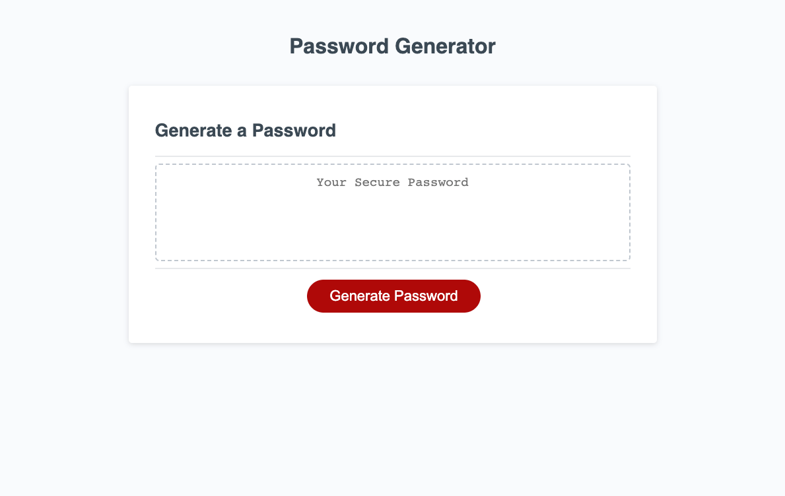

# Random Password Generator

## Description

This random password generator creates a random string of characters to match the indicated length and selected character types input by the user. The page consists of a white background with the heading "Password Generator" at the top & center, a box in the center of the page with the heading "Generate a Password", a dashed border, and placeholder text reading "Your Secure Password". A red button with white text reading "Generate Password" is located below the box. The user can customize their selections to meet their specific password needs, including length of password as well as inclusion of upper case letters, numbers, and/or special characters. This was a good opportunity to practice writing for loops, using window prompt/confirmation/alert, and to study methods for selecting random characters using JavaScript. It also strengthened my understanding of functions and event listeners.

## Table of Contents (Optional)

- [Usage](#usage)
- [Credits](#credits)
- [License](#license)

## Usage

Upon loading the page, click the red "generate" button to begin criteria selection. When prompted, ented desired password length, and select ok to include/cancel to exclude upper case letters, numbers, and special characters. Lower case letters are inculded by default. Once all selections have been made, review selections before selecting OK to generate password, or cancel to start over. The randomly generated password will appear in the box in place of the placeholder text.

[Random Password Generator](https://rbkeyes.github.io/random-password-generator/)

## Credits

Starter code from coding bootcamp gitlab.

[README guide](https://coding-boot-camp.github.io/full-stack/github/professional-readme-guide)

[Stackoverflow: generate random string of characters in javascript](https://stackoverflow.com/questions/1349404/generate-random-string-characters-in-javascript)

[w3schools: window confirm](https://www.w3schools.com/jsref/met_win_confirm.asp)

[Stackoverflow: how do I shuffle the characters in a string in javascript](https://stackoverflow.com/questions/3943772/how-do-i-shuffle-the-characters-in-a-string-in-javascript)

## License

MIT License

Copyright (c) [2022] [Reed Keyes]

Permission is hereby granted, free of charge, to any person obtaining a copy
of this software and associated documentation files (the "Software"), to deal
in the Software without restriction, including without limitation the rights
to use, copy, modify, merge, publish, distribute, sublicense, and/or sell
copies of the Software, and to permit persons to whom the Software is
furnished to do so, subject to the following conditions:

The above copyright notice and this permission notice shall be included in all
copies or substantial portions of the Software.

THE SOFTWARE IS PROVIDED "AS IS", WITHOUT WARRANTY OF ANY KIND, EXPRESS OR
IMPLIED, INCLUDING BUT NOT LIMITED TO THE WARRANTIES OF MERCHANTABILITY,
FITNESS FOR A PARTICULAR PURPOSE AND NONINFRINGEMENT. IN NO EVENT SHALL THE
AUTHORS OR COPYRIGHT HOLDERS BE LIABLE FOR ANY CLAIM, DAMAGES OR OTHER
LIABILITY, WHETHER IN AN ACTION OF CONTRACT, TORT OR OTHERWISE, ARISING FROM,
OUT OF OR IN CONNECTION WITH THE SOFTWARE OR THE USE OR OTHER DEALINGS IN THE
SOFTWARE.
